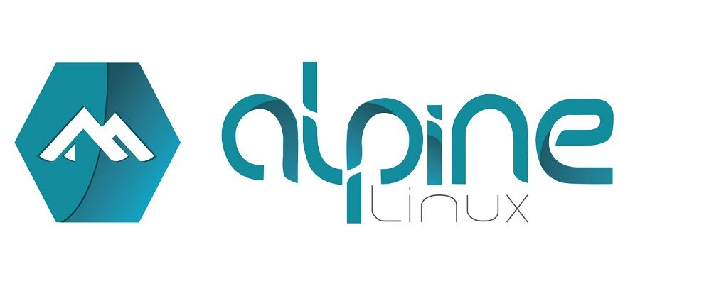

# 42-Inception

The **Inception** project is a comprehensive exercise designed to enhance your system administration skills using Docker. Through this project, you'll gain a deeper understanding of Docker while setting up a small infrastructure within a personal virtual machine according to specific rules and guidelines.

## Project Objectives

The primary goals of this project are:

- **Docker Mastery**: Improve your proficiency with Docker by virtualizing several Docker images.
- **System Administration**: Develop practical skills in system administration.
- **Security Best Practices**: Emphasize and implement best practices in security.
- **Configuration Management**: Understand and apply effective configuration management techniques.

## What is Docker?

Docker is a virtualization application that allows you to run thousands of isolated containers on a single machine.

### Understanding Containers

A container is a lightweight, portable package of software that includes everything needed to run an application: code, runtime, system tools, libraries, and settings. Containers offer several benefits.

### key benefits:

- **Isolation**: Containers isolate software from its environment, which helps mitigate conflicts between different applications running on the same infrastructure. This is particularly useful for handling differences between development, staging, and production environments.
- **Consistency**: By packaging all necessary components, containers ensure that applications run consistently across various environments.

### Docker Containers and Images

Docker containers are created from images. An image is a read-only template with instructions for building a Docker container. Images can be based on other images and customized as needed. For example, you might create an image based on the Ubuntu image, which includes the Apache web server, your application, and all necessary configuration details.

### Container Management

Containers are sandboxed from one another and from the host machine. Docker provides several tools to facilitate container management:

- **Docker CLI**: For creating and managing containers.
- **Docker Images**: For handling and distributing container images.
- **Docker Compose**: For defining and running multi-container Docker applications.

### Benefits of Docker

Docker offers several advantages:

- **Portability**: Package your application with all dependencies into a single container, ensuring it runs the same regardless of the environment.
- **Stability**: Provides a stable environment for running the same code on different platforms, from development laptops to data center VMs and production cloud instances.
- **Efficiency**: Facilitates fast and reliable deployments, testing, and continuous integration across multiple platforms.

Docker enhances the development lifecycle by enabling continuous integration and continuous deployment (CI/CD), ensuring that you and your team can reliably build, test, and deploy applications.

## Containers vs. Virtual Machines

Both containers and virtual machines (VMs) are technologies used to create isolated environments for running applications. While they share some similarities, they differ in several fundamental ways.

  

### Architecture

- **Virtual Machines**: VMs run on a hypervisor, which can be either software, firmware, or hardware that creates and runs virtual machines. Each VM includes a full operating system (OS), along with the necessary binaries and libraries. This makes VMs heavier and more resource-intensive because they replicate the entire OS.

  - **Components**:
    - **Hypervisor**: The layer that enables multiple VMs to run on a single physical machine.
    - **Guest OS**: Each VM includes its own operating system.
    - **Binaries and Libraries**: All the necessary dependencies and software.

- **Containers**: Containers, on the other hand, share the host OS kernel and isolate the application processes from the rest of the system. Containers are lightweight because they don't include a full OS; instead, they package only the necessary binaries, libraries, and dependencies needed to run the application.

  - **Components**:
    - **Container Engine**: Software like Docker that manages container creation and execution.
    - **Shared OS Kernel**: Containers share the host system's OS kernel.
    - **Binaries and Libraries**: Only the essential dependencies and software for the application.

### Resource Efficiency

- **Virtual Machines**: VMs are generally more resource-intensive because they require more memory and storage to run full operating systems. Each VM has a larger footprint due to the overhead of the guest OS.
  
- **Containers**: Containers are more resource-efficient since they share the host OS and only contain the application and its dependencies. This allows for higher density and more efficient utilization of system resources.

### Performance

- **Virtual Machines**: The performance of VMs can be lower compared to containers due to the overhead of the hypervisor and the need to run multiple OS instances. However, they offer strong isolation and are suitable for running multiple different OS environments on the same physical hardware.

- **Containers**: Containers generally offer better performance due to lower overhead, as they share the host OS and do not require a separate OS instance for each container. This makes containers faster to start and more efficient in resource usage.

### Isolation and Security

- **Virtual Machines**: VMs provide strong isolation since each VM runs a separate OS and is isolated by the hypervisor. This makes VMs suitable for running untrusted applications or workloads that require strong security boundaries.

- **Containers**: Containers provide a lighter form of isolation at the process level, sharing the same OS kernel. While modern container platforms offer robust security features, the isolation is not as strong as that provided by VMs. However, containers are continually improving in terms of security.

### Use Cases

- **Virtual Machines**: Ideal for running multiple different OS environments on the same physical machine, legacy application support, and scenarios requiring strong isolation.
  
- **Containers**: Best suited for microservices architecture, continuous integration/continuous deployment (CI/CD) pipelines, and environments where rapid scaling and resource efficiency are critical.

### Summary

- **Virtual Machines**: 
  - Full OS per VM
  - Heavier, more resource-intensive
  - Strong isolation
  - Slower startup times

- **Containers**: 
  - Shared OS kernel
  - Lightweight, resource-efficient
  - Process-level isolation
  - Faster startup times

## Setting Up the Project Environment (VM)

To effectively develop and manage our application, we will be using a virtual machine (VM) as our primary development environment. This approach allows us to create a controlled and isolated space where we can build, test, and run our Docker containers.

### Choosing Images: Alpine Linux vs. Debian

For this project, we'll select a Linux distribution for both the Virtual Machine (VM) and the Docker containers. Here’s a quick overview of Alpine Linux and Debian, along with their pros and cons:

### Alpine Linux

Alpine Linux is a lightweight and security-oriented Linux distribution designed for efficiency and simplicity.

  

<table>
  <thead>
    <tr>
      <th>Pros</th>
      <th>Cons</th>
    </tr>
  </thead>
  <tbody>
    <tr>
      <td><strong>Small Footprint</strong>: Minimal size, which reduces the image size and improves performance.</td>
      <td><strong>Compatibility Issues</strong>: May require additional configuration for compatibility with some software.</td>
    </tr>
    <tr>
      <td><strong>Security Focused</strong>: Designed with security in mind, featuring a hardened kernel and security tools.</td>
      <td><strong>Limited Packages</strong>: Smaller package repository compared to Debian, which may require manual installation of some software.</td>
    </tr>
    <tr>
      <td><strong>Fast Startup</strong>: Quick boot times and efficient resource usage.</td>
      <td><strong>Less User-Friendly</strong>: May have a steeper learning curve for users unfamiliar with its minimalistic design.</td>
    </tr>
  </tbody>
</table>

---

### Debian

Debian is a widely used and stable Linux distribution known for its robustness and extensive package repository.

  

<table>
  <thead>
    <tr>
      <th>Pros</th>
      <th>Cons</th>
    </tr>
  </thead>
  <tbody>
    <tr>
      <td><strong>Extensive Package Repository</strong>: Large selection of pre-built packages and software.</td>
      <td><strong>Larger Image Size</strong>: Generally larger image size compared to Alpine, which may impact performance.</td>
    </tr>
    <tr>
      <td><strong>Stability</strong>: Well-tested and stable releases suitable for production environments.</td>
      <td><strong>Slower Startup</strong>: Larger footprint can lead to slower boot times and higher resource usage.</td>
    </tr>
    <tr>
      <td><strong>User-Friendly</strong>: More familiar to many users, with extensive documentation and community support.</td>
      <td><strong>Security Updates</strong>: May not be as aggressively updated for security as Alpine.</td>
    </tr>
  </tbody>
</table>
