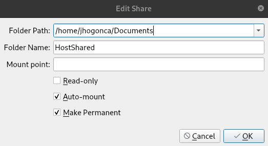

# 42-Inception

The **Inception** project is a comprehensive exercise designed to enhance your system administration skills using Docker. Through this project, you'll gain a deeper understanding of Docker while setting up a small infrastructure within a personal virtual machine according to specific rules and guidelines.

## Project Objectives

The primary goals of this project are:

- **Docker Mastery**: Improve your proficiency with Docker by virtualizing several Docker images.
- **System Administration**: Develop practical skills in system administration.
- **Security Best Practices**: Emphasize and implement best practices in security.
- **Configuration Management**: Understand and apply effective configuration management techniques.

## What is Docker?

Docker is a virtualization application that allows you to run thousands of isolated containers on a single machine.

### Understanding Containers

A container is a lightweight, portable package of software that includes everything needed to run an application: code, runtime, system tools, libraries, and settings. Containers offer several benefits.

### key benefits:

- **Isolation**: Containers isolate software from its environment, which helps mitigate conflicts between different applications running on the same infrastructure. This is particularly useful for handling differences between development, staging, and production environments.
- **Consistency**: By packaging all necessary components, containers ensure that applications run consistently across various environments.

### Docker Containers and Images

Docker containers are created from images. An image is a read-only template with instructions for building a Docker container. Images can be based on other images and customized as needed. For example, you might create an image based on the Ubuntu image, which includes the Apache web server, your application, and all necessary configuration details.

### Container Management

Containers are sandboxed from one another and from the host machine. Docker provides several tools to facilitate container management:

- **Docker CLI**: For creating and managing containers.
- **Docker Images**: For handling and distributing container images.
- **Docker Compose**: For defining and running multi-container Docker applications.

### Benefits of Docker

Docker offers several advantages:

- **Portability**: Package your application with all dependencies into a single container, ensuring it runs the same regardless of the environment.
- **Stability**: Provides a stable environment for running the same code on different platforms, from development laptops to data center VMs and production cloud instances.
- **Efficiency**: Facilitates fast and reliable deployments, testing, and continuous integration across multiple platforms.

Docker enhances the development lifecycle by enabling continuous integration and continuous deployment (CI/CD), ensuring that you and your team can reliably build, test, and deploy applications.

## Containers vs. Virtual Machines

Both containers and virtual machines (VMs) are technologies used to create isolated environments for running applications. While they share some similarities, they differ in several fundamental ways.

<div style="text-align:center; background-color:#f0f0f0; padding:10px; display:inline-block;">
  
</div>


### Architecture

- **Virtual Machines**: VMs run on a hypervisor, which can be either software, firmware, or hardware that creates and runs virtual machines. Each VM includes a full operating system (OS), along with the necessary binaries and libraries. This makes VMs heavier and more resource-intensive because they replicate the entire OS.

  - **Components**:
    - **Hypervisor**: The layer that enables multiple VMs to run on a single physical machine.
    - **Guest OS**: Each VM includes its own operating system.
    - **Binaries and Libraries**: All the necessary dependencies and software.

- **Containers**: Containers, on the other hand, share the host OS kernel and isolate the application processes from the rest of the system. Containers are lightweight because they don't include a full OS; instead, they package only the necessary binaries, libraries, and dependencies needed to run the application.

  - **Components**:
    - **Container Engine**: Software like Docker that manages container creation and execution.
    - **Shared OS Kernel**: Containers share the host system's OS kernel.
    - **Binaries and Libraries**: Only the essential dependencies and software for the application.

### Resource Efficiency

- **Virtual Machines**: VMs are generally more resource-intensive because they require more memory and storage to run full operating systems. Each VM has a larger footprint due to the overhead of the guest OS.
  
- **Containers**: Containers are more resource-efficient since they share the host OS and only contain the application and its dependencies. This allows for higher density and more efficient utilization of system resources.

### Performance

- **Virtual Machines**: The performance of VMs can be lower compared to containers due to the overhead of the hypervisor and the need to run multiple OS instances. However, they offer strong isolation and are suitable for running multiple different OS environments on the same physical hardware.

- **Containers**: Containers generally offer better performance due to lower overhead, as they share the host OS and do not require a separate OS instance for each container. This makes containers faster to start and more efficient in resource usage.

### Isolation and Security

- **Virtual Machines**: VMs provide strong isolation since each VM runs a separate OS and is isolated by the hypervisor. This makes VMs suitable for running untrusted applications or workloads that require strong security boundaries.

- **Containers**: Containers provide a lighter form of isolation at the process level, sharing the same OS kernel. While modern container platforms offer robust security features, the isolation is not as strong as that provided by VMs. However, containers are continually improving in terms of security.

### Use Cases

- **Virtual Machines**: Ideal for running multiple different OS environments on the same physical machine, legacy application support, and scenarios requiring strong isolation.
  
- **Containers**: Best suited for microservices architecture, continuous integration/continuous deployment (CI/CD) pipelines, and environments where rapid scaling and resource efficiency are critical.

### Summary

- **Virtual Machines**: 
  - Full OS per VM
  - Heavier, more resource-intensive
  - Strong isolation
  - Slower startup times

- **Containers**: 
  - Shared OS kernel
  - Lightweight, resource-efficient
  - Process-level isolation
  - Faster startup times

## Setting Up the Project Environment (VM)

To effectively develop and manage our application, we will be using a virtual machine (VM) as our primary development environment. This approach allows us to create a controlled and isolated space where we can build, test, and run our Docker containers.

### Choosing Images: Alpine Linux vs. Debian

For this project, we'll select a Linux distribution for both the Virtual Machine (VM) and the Docker containers. Here’s a quick overview of Alpine Linux and Debian, along with their pros and cons:

### Alpine Linux

Alpine Linux is a lightweight and security-oriented Linux distribution designed for efficiency and simplicity.

<div style="text-align:center; background-color:white; padding:10px;">
  
</div>

<table>
  <thead>
    <tr>
      <th>Pros</th>
      <th>Cons</th>
    </tr>
  </thead>
  <tbody>
    <tr>
      <td><strong>Small Footprint</strong>: Minimal size, which reduces the image size and improves performance.</td>
      <td><strong>Compatibility Issues</strong>: May require additional configuration for compatibility with some software.</td>
    </tr>
    <tr>
      <td><strong>Security Focused</strong>: Designed with security in mind, featuring a hardened kernel and security tools.</td>
      <td><strong>Limited Packages</strong>: Smaller package repository compared to Debian, which may require manual installation of some software.</td>
    </tr>
    <tr>
      <td><strong>Fast Startup</strong>: Quick boot times and efficient resource usage.</td>
      <td><strong>Less User-Friendly</strong>: May have a steeper learning curve for users unfamiliar with its minimalistic design.</td>
    </tr>
  </tbody>
</table>

---

### Debian

Debian is a widely used and stable Linux distribution known for its robustness and extensive package repository.

<p style="background-color:white;">
  
</p>


<table>
  <thead>
    <tr>
      <th>Pros</th>
      <th>Cons</th>
    </tr>
  </thead>
  <tbody>
    <tr>
      <td><strong>Extensive Package Repository</strong>: Large selection of pre-built packages and software.</td>
      <td><strong>Larger Image Size</strong>: Generally larger image size compared to Alpine, which may impact performance.</td>
    </tr>
    <tr>
      <td><strong>Stability</strong>: Well-tested and stable releases suitable for production environments.</td>
      <td><strong>Slower Startup</strong>: Larger footprint can lead to slower boot times and higher resource usage.</td>
    </tr>
    <tr>
      <td><strong>User-Friendly</strong>: More familiar to many users, with extensive documentation and community support.</td>
      <td><strong>Security Updates</strong>: May not be as aggressively updated for security as Alpine.</td>
    </tr>
  </tbody>
</table>

---

### General Purposes and Use Cases

- **Alpine**: Alpine Linux is ideal for minimalism, particularly suited for microservices or single-purpose containers. Its small image size and focus on security make it a great choice for edge computing and container orchestration platforms like Kubernetes.

- **Debian**: Debian is a versatile and robust choice for a wide range of applications. Its extensive package repository and compatibility with various software make it well-suited for general-purpose containers, especially in traditional server environments.

The decision between Alpine and Debian hinges on specific needs such as image size, compatibility, and the required software. For this project, I choose Debian for two main reasons:

1. **Versatility**: Debian supports a wide range of features and is compatible with various tools and software, which is advantageous for me in completing all project requirements, including the bonuses I want to do.
   
2. **Documentation**: Say what you want, but Debian has been, overtime, more used elsewhere and, therefore, more documentated. You can find just about anything for Debian troubleshooting, which makes this whole ordeal much easier.

### Pre-Requisites

Now, let's prepare to the fun part. Before we can start working on the project, though, we need to set up our environment, and that said the environment consists of a Virtual Machine and Docker installed on it.

For this, the initial setup consists of only two downloadables:

-	**VirtualBox**: VirtualBox is a general-purpose full virtualizer, aimed at enabling users to run multiple operating systems in virtual machines. For this project, we will be using VirtualBox to run a Debian system on top of our own OS.

-	**Debian**: Debian is an open-source operating system that runs from the desktop, to the cloud, to all your internet connected things. We will be using Debian inside our VirtualBox to run the project.

I will not be covering the installation of these two, as they are pretty straightforward and widely available online. If you encounter any issues, numerous tutorials can guide you through the process.

### Setting up Virtual Machine

This part is totally personal and you can feel free to configure your VM according to your preferences;
this is just an example of how I set mine up. 

### VM Configuration

- **Virtualization Platform:** VirtualBox
- **ISO Image:** Debian 11.9.0 (amd64) – Chosen as the penultimate stable version for this setup.
- **Username:** sopadegalinha
- **Password:** ********
- **Hostname:** Inception
- **Domain Name:** myguest.virtualbox.org
- **Install in Background:** Off
- **Guest Additions:** Off *(To be installed later)*
- **Base Memory:** 8192 MB
- **Processors:** 7
- **Enable EFI:** Off
- **Disk Size:** 20 GB
- **Pre-allocate Full Size:** Off
- **VM Size:** 25 GB *(More than enough for the project)*

### APT Repository Configuration

The **`apt`** configuration file (`/etc/apt/sources.list`) specifies the repositories from which Debian retrieves software packages and updates. Each repository section serves a distinct purpose to ensure the system has access to necessary software components and updates.

- **Create:** `/etc/apt/sources.list` (if not already present)
- **Main Repositories:** Provides essential Debian packages categorized into `main`, `contrib`, and `non-free`, including fundamental software for basic system functionality.
- **Security Updates:** Ensures timely patches for security vulnerabilities from dedicated security repositories.
- **Stable Updates:** Offers recommended updates that enhance system stability without compromising security.
- **Backports:** Contains newer packages from more recent Debian releases, available for installation if needed.

**/etc/apt/sources.list** content:

```bash
# Main repositories
deb http://deb.debian.org/debian/ bullseye main contrib non-free
deb-src http://deb.debian.org/debian/ bullseye main contrib non-free

# Security updates
deb http://security.debian.org/debian-security bullseye-security main contrib non-free
deb-src http://security.debian.org/debian-security bullseye-security main contrib non-free

# Stable updates (recommended updates that are not security-related)
deb http://deb.debian.org/debian/ bullseye-updates main contrib non-free
deb-src http://deb.debian.org/debian/ bullseye-updates main contrib non-free

# Backports (newer packages from newer Debian versions that can be installed if needed)
deb http://deb.debian.org/debian bullseye-backports main contrib non-free
deb-src http://deb.debian.org/debian bullseye-backports main contrib non-free
```

**Update and Upgrade Packages:**

```bash
sudo apt update && sudo apt upgrade
```

### Guest Additions Configuration

- **Download VirtualBox Guest Additions ISO:**
  - **Website:** [VirtualBox Guest Additions](https://packages.debian.org/source/sid/virtualbox-guest-additions-iso)
  - **File:** `virtualbox-guest-additions-iso_7.0.18.orig.tar.xz` was the latest at the time
  - **Get the path:** Unzip the file and locate the VBoxGuestAdditions*.iso.

- **Create Guest Additions Folder:**

```bash
sudo mkdir /mnt/guest_additions
```

- **Build the ISO Image:**

```bash
sudo mount -o loop <path/to/file>VBoxGuestAdditions_*.iso /mnt/guest_additions
```
Replace `<path/to/file>` with the actual path of the downloaded ISO for the Guest Additions.

- **Navigate to the Guest Additions Folder** and execute the installation script:

```bash
sudo sh ./VBoxLinuxAdditions.run
```

- **Set Up a Shared Folder in VirtualBox Manager:**
  - Select your VM → **Settings** → **Shared Folders**
  - **Add a New Shared Folder:**
    - Click the folder icon with a plus sign.
    - **Folder Path:** Select the folder on your host machine to share.
    - **Folder Name:** Set the name used inside the VM.
    - **Auto-mount:** Check to automatically mount the folder when the VM starts.
    - **Make Permanent:** Check to persist across VM reboots.
    - Click **OK** to save the settings.
	- Exemple
		<div style="text-align:right; background-color:#f0f0f0; padding:10px; display:inline-block;">
		
		</div>

- **Reboot the Virtual Machine:**

```bash
sudo reboot
```

### To Use the VM via SSH (Optional)

- **Install OpenSSH:**

```bash
sudo apt install openssh-server
```

- **Enable SSH:**

```bash
sudo systemctl start ssh && sudo systemctl enable ssh
```

- **Configure Network in VirtualBox Manager:**
  - Turn off the VM → **Settings** → **Network**
  - **Attached to:** Bridged Adapter
  - **Name:** eno2
  - Turn on the VM.

- **Get the IP Address of the VM:**

```bash
hostname -I
```

- **Connect to the VM Using SSH:**

```bash
ssh <VM user>@<VM IP address>
```
---

## Docker and Docker Compose Installation

With the machine up and running, it’s time to install Docker and Docker Compose

- **Docker:**
  - **Remove Old Versions (Optional):**

    ```bash
    sudo apt-get remove docker docker-engine docker.io containerd runc
    ```

  - **Install Dependencies:**

    ```bash
    sudo apt-get install \
    apt-transport-https \
    ca-certificates \
    curl \
    gnupg \
    lsb-release
    ```

  - **Add Docker GPG Official Key:**

    ```bash
    curl -fsSL https://download.docker.com/linux/debian/gpg | sudo gpg --dearmor -o /usr/share/keyrings/docker-archive-keyring.gpg
    ```

  - **Add the Stable Docker Repository:**
    - For Bullseye (Debian 11):

      ```bash
      echo \
        "deb [arch=amd64 signed-by=/usr/share/keyrings/docker-archive-keyring.gpg] https://download.docker.com/linux/debian \
        $(lsb_release -cs) stable" | sudo tee /etc/apt/sources.list.d/docker.list > /dev/null
      ```

  - **Install Docker Engine:**

    ```bash
    sudo apt-get update
    sudo apt-get install docker-ce docker-ce-cli containerd.io
    ```

  - **Execute Docker Without Sudo (Optional):**

    ```bash
    sudo usermod -aG docker $USER
    ```

  - **Docker Version Used:** `docker -v` - **26.1.4, build 5650f9b**
  - **Reboot the Virtual Machine:**

    ```bash
    sudo reboot
    ```

- **Docker Compose:**
  - **Download the Current Stable Release:**

    ```bash
    DOCKER_COMPOSE_VERSION=$(curl -s https://api.github.com/repos/docker/compose/releases/latest | grep '"tag_name":' | sed -E 's/.*"([^"]+)".*/\1/')
    sudo curl -L "https://github.com/docker/compose/releases/download/${DOCKER_COMPOSE_VERSION}/docker-compose-$(uname -s)-$(uname -m)" -o /usr/local/bin/docker-compose
    ```

  - **Apply Executable Permissions:**

    ```bash
    sudo chmod +x /usr/local/bin/docker-compose
    ```

  - **Docker Compose Version Used:** `docker-compose -v` - **v2.27.1**

